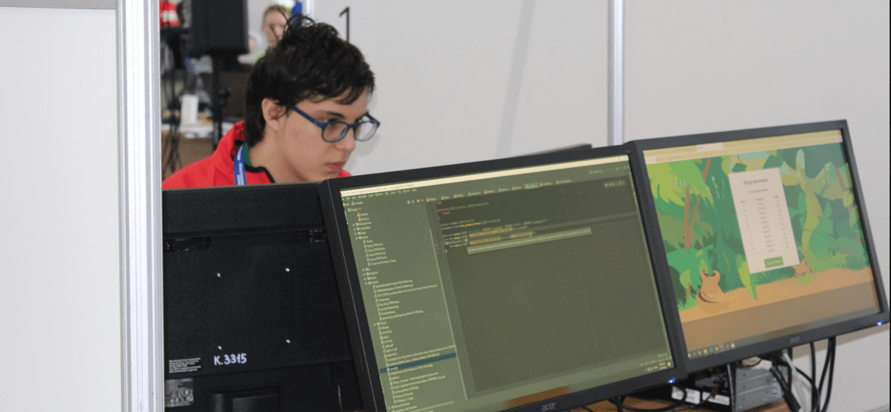

## 👋 Введение

Привет, меня зовут **Айдан Миннегараев**. Я **PHP** Junior и **Go** Junior разработчик. 
Я являюсь студентом СПбГЭТУ «ЛЭТИ», учусь на 2 курсе в 
направлении "Информационные системы и технологии".

Сейчас я нахожусь в поисках работы 
на позиции **PHP Junior Developer** или **Go Junior Developer**.

[Резюме](https://docs.google.com/document/d/1qTGiGnUv9JuIyVqjItMgF2wbIAZDVLZ0Gm0el7Nwkws/edit#)

## 💼 Личные/учебные проекты

### GreenWix (2018-2021)
GreenWix был одним из самых популярных серверов 
Minecraft: Pocket Edition в СНГ. Рекорд онлайна - **2210** игроков.

На этом проекте на **Go** я сделал
[сервис](https://github.com/NolikTop/watcher), 
следящий за состоянием серверов.

Занимался бекенд-разработкой (API для магазина, личного кабинета) 
на базе [собственного фреймворка](https://github.com/GreenWix/prismaFrame) 
на **PHP**.

Еще на этом проекте я занимался фронтендом (https://gwix.shop https://greenwix.fun https://account.greenwix.fun), мини-приложением на платформе VK Mini Apps (https://vk.com/app7066204).

Также реализовывал мини-игры на **PHP** на базе собственного решения, являющегося форком  https://github.com/pmmp/PocketMine-MP.

### math_server (2021)
Математическая библиотека для работы с длинными числами. 
Была реализована в рамках коллоквиума по Дискретной математике.

Был реализован сам [бекенд с библиотекой](https://github.com/PovezloPovezlo/math_server)
на **C++** и 
[фронтенд](https://github.com/PovezloPovezlo/math_client)
на **TypeScript** + **React** + **Material-UI**. 

## 🏆 Достижения

### 🥇 WorldSkills (2019)

Я **победил** в финале VII национального чемпионата 
WorldSkills Russia в компетенции "Веб-дизайн и разработка - юниоры".

